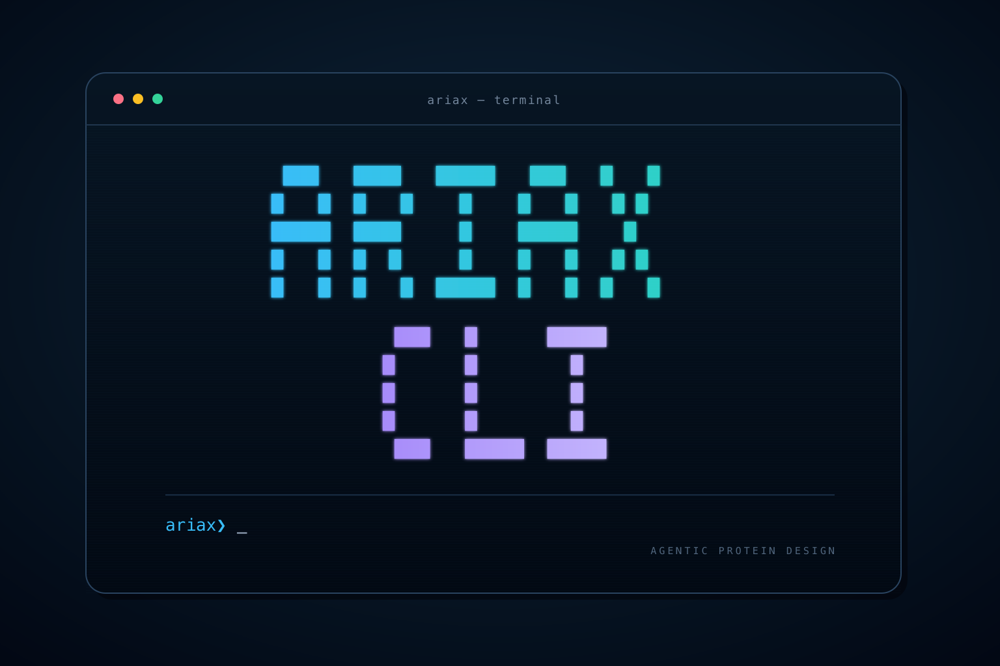

<h1 align="center">Ariax CLI</h1>

<p align="center">
  Run protein-design campaigns from your terminal—or let a coding agent run them with you.
</p>

<p align="center">
  
</p>

<p align="center">
  <a href="https://www.ariax.bio">Website</a> ·
  <a href="https://www.ariax.bio/docs">Docs</a> ·
  <a href="https://www.ariax.bio/settings/api-keys">API keys</a> ·
  <a href="https://www.ariax.bio/pricing">Pricing</a> ·
  <a href="https://www.ariax.bio/contact">Support</a>
</p>

`ariax` is the command-line interface for [Ariax Bio](https://www.ariax.bio),
a platform for running modern protein-design workflows without managing GPU
infrastructure. It prepares inputs, launches projects, follows progress, and
downloads results from your terminal, scripts, or an AI coding agent.

| Workflow | What you can design |
| --- | --- |
| [BindCraft](https://www.ariax.bio/docs/bindcraft-project-setup) | De novo miniproteins and linear alpha-helical peptides ([agent guide](agent-skills/skills/ariax-bindcraft/SKILL.md)) |
| [BindCraft2](https://www.ariax.bio/docs/bindcraft2-project-setup) | Proteins, peptides, VHHs, scFvs, Fabs, ARPs, oligomers, and multidomain binders ([agent guide](agent-skills/skills/ariax-bindcraft2/SKILL.md)) |
| [BoltzGen](https://www.ariax.bio/docs/boltzgen-project-setup) | Miniproteins, VHHs, linear and cyclic peptides, helicons, and miniproteins targeting small molecules ([agent guide](agent-skills/skills/ariax-boltzgen/SKILL.md)) |
| [PXDesign](https://www.ariax.bio/docs/pxdesign-project-setup) | Diffusion-designed miniprotein binders ([agent guide](agent-skills/skills/ariax-pxdesign/SKILL.md)) |
| [ESMFold2-pipeline](https://www.ariax.bio/docs/esmfold2-pipeline-project-setup) | Miniproteins, VHHs, and scFvs ([agent guide](agent-skills/skills/ariax-esmfold2-pipeline/SKILL.md)) |

## Install

Install [Node.js 20 or newer](https://nodejs.org/), then install the latest
stable release from [npm](https://www.npmjs.com/package/ariax-cli):

```sh
npm install --global ariax-cli@latest
```

For the latest development commit from GitHub, use the install script instead:

```sh
curl -fsSL https://raw.githubusercontent.com/cytokineking/ariax-cli/main/install.sh | sh
```

Both methods require Node.js and npm. Check your installed version, channel,
and commit with:

```sh
ariax --version
ariax help
```

## Updates

During interactive use, the CLI checks for updates at most once per day. npm
installs check the latest npm release; script installs check GitHub `main` for a
new commit, even when the version number stays the same. It shows a notice when
an update is available. Updates are installed only when you request them:

```sh
ariax upgrade --check    # Check now
ariax upgrade            # Update your current channel, with confirmation
ariax upgrade --yes      # Update without a prompt
```

Automatic checks are skipped in CI, noninteractive commands, and JSON output.
Set `NO_UPDATE_NOTIFIER=1` to disable them.

### Switch between npm and the script install

```sh
ariax upgrade --channel npm       # Switch to the latest stable npm release
ariax upgrade --channel github    # Switch to the latest GitHub main commit
```

You can also rerun either installation command above to switch. Both methods
use the same npm-managed package and `ariax` command, so switching replaces the
existing installation and preserves your login and project files. It works even
when both builds have the same version; switching to npm may select an older
build than GitHub. Future upgrades follow the channel you selected.

Use the same Node.js installation and npm global prefix for both methods. If you
have multiple installations, compare `type -a ariax` with `npm prefix --global`.
For an existing installation under `/opt/homebrew`, for example, target it with
`npm_config_prefix=/opt/homebrew ariax upgrade` (add `--channel npm` to switch).

## Connect your account

Create a key on the [Ariax API keys page](https://www.ariax.bio/settings/api-keys),
then connect the CLI:

```sh
ariax login
ariax me
```

`ariax login` accepts the key in a hidden prompt, verifies it with Ariax, and
saves it in your system credential store. If the system store is unavailable,
the CLI asks before using a user-only credential file. The first authenticated
command can start the same login flow automatically.

Run `ariax logout` to remove the locally saved credential. This does not revoke
the key in your Ariax account. For non-interactive automation, inject
`ARIAX_API_KEY` from your secret manager; it takes precedence over saved login.
Tools that can supply a secret through standard input may use
`ariax login --with-token` as the non-interactive equivalent.
The CLI intentionally does not support `--api-key`, because command-line
secrets can appear in shell history and process lists.

## Run a project

Discover the live API contract, then copy a starter job file:

```sh
ariax protocols
ariax schema bindcraft-v1.5 --raw -o bindcraft-schema.json
ariax skills --read --no-json
ariax skills bindcraft-v1.5 --read --no-json
ariax skills bindcraft-v1.5 --reference outputs --read --no-json
```

`ariax skills --json` lists every bundled guide and reference identifier. The
`--read --no-json` forms print the selected Markdown directly; `--read --json`
returns it in `data.content`, so an agent does not need a separate filesystem
tool. When consuming the normal schema envelope instead of `--raw`, use the
exact schema at `.data.json_schema`.

Edit `job.json` for your target, then validate it with the structure file.
Validation does not start compute.

```sh
ariax validate -f job.json --input ./target.pdb
```

Once it passes, submit and wait. **Submission starts billable compute.**

```sh
ariax submit \
  -f job.json \
  --input ./target.pdb \
  --name first-bindcraft-run \
  --wait
```

Use the returned project ID to come back later or download results:

```sh
ariax status <PROJECT_ID> --wait
ariax results <PROJECT_ID> --download ./ariax-results
```

BindCraft2 jobs can name several target and scaffold files. Put those exact
basenames in one directory and use `--input-dir` with `inputs inspect`,
`inputs prepare`, `validate`, and `submit`. It is mutually exclusive with
`--input`. The prepared directory contains the normalized job, every required
file, and a manifest of byte counts and SHA-256 hashes.

The browser URL is `https://www.ariax.bio/projects/<engine>/<id>`, where the
engine segment is `bindcraft`, `bindcraft2`, `boltzgen`, `pxdesign`, or `esmfold2-pipeline`.

Starter files for all five workflows are in
[`agent-skills/examples/`](agent-skills/examples). Always use `ariax schema`
and the matching agent guide for current fields, target preparation, and
residue numbering.

## Inspect and prepare inputs locally

These commands require no API key. Inspection reads a local structure or downloads
one structure from the fixed RCSB files endpoint (mmCIF by default; PDB when
the explicit job selects BindCraft):

```sh
ariax inputs inspect --input ./target.pdb --json
ariax inputs inspect --pdb 1ABC --json
ariax inputs inspect --input ./target.cif -f job.json --full --json
ariax inputs inspect --input-dir ./bc2-inputs -f bc2-job.json --details --json
ariax inputs prepare --input ./target.cif -f job.json --output ./prepared --json
```

Inspection reports chain IDs, sequence provenance, author/label residue mappings,
unresolved sequence regions, and warnings. With `-f`, `preparation.ready` reports
whether the explicit job can be prepared and lists proposed supported repairs.
Inspection itself does not validate the full server schema. Default console output
omits sequence text and limits mapping rows. BindCraft2 compact inspection reports
only relevant filenames and roles, targets, selected chains or FASTA records,
authoritative chain counts and visible preview truncation, lengths, selector
validation, scaffold edits, and warnings. Use `--full` for
complete sequences and residue maps, and `--details` for manifest hashes, build
identity, and the prior diagnostic field layout; the flags can be combined. Other
protocols keep their released bounded inspection shape, where each chain's
`residue_count` is authoritative and `residues_truncated` marks a preview. For
example, a PD-1 chain with 106 mapped residues can have 85 preview rows. Both
sources have a 10 MB limit. RCSB downloads have a 30-second total timeout;
`--timeout` can lower it. Download redirects are rejected.

Preparation requires explicit protocol and chain selections in `job.json`; it
never chooses target sites or prompts for missing sequences. These are structure-dependent
checks; use `ariax validate` for the live server schema. Preparation writes a new
`input.pdb` or `input.cif`, `job.json`, and `input-manifest.json` into `--output`.
The original input and job remain untouched. An identical repeat succeeds without
rewriting files; a different preparation requires another output directory.
Supported repairs include ESMFold2 author atom IDs/chain IDs and missing PXDesign
polymer metadata. PXDesign PDBs whose full sequence cannot survive its coordinate
converter are rejected: provide canonical mmCIF with the full polymer sequence
and matching author/label identifiers.

The version-1 `ariax_input` manifest records CLI version/channel/source revision,
source and prepared byte SHA-256 hashes, exact source/prepared job hashes, selected
chains, sequence provenance, residue maps, unresolved regions, typed supported
transformations, and preparation notes. File references are relative to the
manifest directory. `sequence_position` is 1-based in the recorded sequence;
author and label numbers remain in their respective coordinate conventions.
Unavailable mappings are `null`, never guessed. Sequences derived from observed
coordinates cannot reveal unresolved terminal residues. The full manifest is
always written even when console output is compact.

Validate and submit the saved pair together. Submission starts billable compute:

```sh
ariax validate -f ./prepared/job.json --input ./prepared/input.cif
ariax submit -f ./prepared/job.json --input ./prepared/input.cif --name prepared-run
```

## Use Ariax with a coding agent

The npm package includes portable Markdown skills for agents. No MCP server is
required. Run `ariax login` once on the machine where the agent uses the CLI,
then give the agent this:

```text
Use the Ariax CLI for my protein-design project. Verify `ariax --version`, run
`ariax upgrade --check --json`, and tell me if an update is available; do not
upgrade without my approval. Run `ariax skills --read --json`, then
`ariax skills <protocol> --read --json` and
`ariax skills <protocol> --reference outputs --read --json` for the selected
protocol; read each `data.content`. Fetch the live schema,
prepare and validate the inputs, and show me the final configuration. Wait for
my approval before submitting billable compute. After approval, submit the
project, monitor it, and download its results. If Ariax is not connected, ask
me to run `ariax login` in my terminal. Never ask me to paste an API key into
this conversation or pass one as a command-line argument.
```

The [shared agent workflow](agent-skills/SKILL.md) covers safe submission,
recovery, monitoring, and downloads. Each protocol guide adds its scientific
capabilities and input rules.

## Command overview

| Task | Command |
| --- | --- |
| Local input inspection/preparation | `ariax inputs inspect --input FILE`, `ariax inputs prepare --input FILE -f job.json --output DIR` |
| Connect or disconnect | `ariax login`, `ariax logout` |
| Account and discovery | `ariax me`, `ariax protocols`, `ariax schema <PROTOCOL>`, `ariax skills [PROTOCOL] [--reference ID] --read` |
| Current GPU hourly prices | `ariax pricing`, `ariax pricing --json` |
| Validate | `ariax validate -f job.json [--input target.pdb]` |
| Launch | `ariax submit -f job.json --name NAME [--input target.pdb] [--wait]` |
| Recover an attempt | `ariax operations [OPERATION_ID]`, `ariax recover OPERATION_ID [--wait]` |
| Find and monitor | `ariax projects`, `ariax status <PROJECT_ID>`, `ariax jobs --project <PROJECT_ID>` |
| Inspect output | `ariax logs <JOB_ID> --list`, `ariax logs <JOB_ID> --log-ref PATH`, `ariax results <PROJECT_ID> --download ./results` |
| Control a project | `ariax pause <PROJECT_ID>`, `ariax restart <PROJECT_ID>`, `ariax abort <PROJECT_ID>` |
| Inspect run evidence | `ariax runs PROJECT_ID [--job JOB_ID] --json` |
| Read candidate tables | `ariax candidates PROJECT_ID [--view final\|all\|diagnostics] [--all] --json` |
| Export configuration | `ariax projects export PROJECT_ID --output job.json` |
| Change GPU preferences | `ariax gpu-preferences <PROJECT_ID> -f preferences.json` |
| Check or install updates | `ariax upgrade --check`, `ariax upgrade` |

For structure-backed BoltzGen jobs, `--input` is required on both `validate`
and `submit`. The `miniprotein-small-molecule` mode has no structure input.

Run `ariax help <COMMAND>` for complete usage. Add `--json` for scripts, and
keep human help output out of the JSON file. The [safe shell example](agent-skills/core/examples.md#safe-scripted-output)
preserves the CLI exit code and stderr before parsing. Submit,
restart, and recovery require an API key with both `read` and `write` scopes.
Before a spending request, the CLI records its original key, exact request, API
origin, account, source hashes, upload intent, and frozen prepared input under
`<root-dir>/.ariax/operations/`. Each attempt has a separate private record;
credentials and signed URLs are excluded.

If a submit or restart reply is lost, use `ariax operations` to find its local
operation ID, then reconcile that retained operation once with
`ariax recover OPERATION_ID`. An `in_progress` result can be followed with
`--wait`, which only polls. If remote reconciliation establishes `state: failed`,
JSON `error.message` includes the operation ID and `state: failed`;
`error.retryable: false` marks that operation terminal, so repeated recovery
cannot advance it. Record the cause, diagnose it, and create a separate fresh
operation only if it fits the user's existing campaign authorization; obtain
authorization for any material change. Never generate a fresh submission
automatically while the first response remains uncertain. Recovery first checks
the actor-owned server record. It replays the saved request with the same key only
when no record exists within the retention window, or the server permits reclaiming
an unstarted lease. `202 in_progress` remains recoverable even before a project ID
exists. Waiting never replays a request. Changed existing source files, prepared
bytes, accounts, or origins block replay; deleted original files can be recovered
from the frozen request and input. After the server's seven-day retention window,
inspect the project before creating a new attempt: the old key cannot safely be
replayed.

Interrupting `--wait` leaves remote work running. Continue with
`ariax recover OPERATION_ID --wait` or `ariax status PROJECT_ID --wait`.
Existing `resume.json` files still work with `ariax status --resume --wait` and
`ariax submit --resume`; new status waits are stored separately per project.
Operation records remain available after completion for reconciliation. Their
`completed` state means the create/restart request completed, not that the compute
job finished; use project status to track compute.

Use `ariax pricing` to check current hourly prices, or `ariax pricing --json`
for the API rates and pricing source. Prices are USD per complete allocation-hour.
Turbo hourly pricing is `(single-GPU hourly price + $1) × GPU count`.
Choose a range of compatible GPUs within the user's hourly price preferences to
maximize availability. The live schema defines compatible GPU identifiers and
memory requirements still apply. Do not estimate campaign duration or total cost.
For new BindCraft, BindCraft2, BoltzGen, and ESMFold2-pipeline selections, treat
the exact `RTX6000PRO` identifier as a primary supported option when advertised
by the live schema. It is distinct from `RTX6000ADA` and `A6000`; PXDesign does
not support it. Keep an existing project's saved or user-specified selection
unchanged unless the user asks to replace that policy.

GPU preference files replace the saved allocation policy, for example:

```json
{"priority_mode":"cost","allowed_gpus":["H100","A100_80GB"],"turbo_mode":false,"turbo_multiples":[]}
```

`priority_mode` and `allowed_gpus` are required. Omitted `turbo_mode` defaults
to `false`; when it is `true`, omitted or empty `turbo_multiples` selects
`[2,4,8]`. Preferences apply to the next provisioning attempt. Saving them
does not change active GPU instances or restart the project.

Only paused projects can be restarted. Failed projects cannot be restarted;
inspect retained worker logs and contact support. `ariax recover` reconciles an
uncertain create/restart request, rather than restarting failed compute.

To diagnose a job failure:

```bash
ariax status PROJECT_ID
ariax logs JOB_ID --list
ariax logs JOB_ID --log-ref logs/design_workers/WORKER.log --tail 200
```

The default log is a campaign/run summary. Worker logs contain detailed
tracebacks; a worker exit code alone does not establish the cause. `--list`
follows all discovery pages and returns usable project-relative references,
labels, sizes, and modification times. Default JSON reads identify the selected
`log_ref`. Logs are read through a sanitized, bounded endpoint rather than raw
download URLs. A missing retained log does not imply it will appear later.

`ariax results` discovers synced scientific intermediates and useful project
metadata beyond the website's curated listing. ESMFold2 includes target
preprocessing, pipeline configs, campaign/sync SQLite ledgers, checkpoints and
restore manifests. Credentials, orchestration code, opaque content-addressed
copies, and bundles containing unsanitized logs are excluded; scientific files
inside intermediate trees remain individually downloadable.

Structure files are parsed locally and uploaded directly to private object
storage with a short-lived URL—their bytes do not pass through Ariax
application servers. `ariax logs` returns only retained project/campaign output
associated with the job, not platform or infrastructure logs. A truncated
response is not evidence about the whole run; request a larger bounded `--tail`
(up to 5000) before drawing a run-wide conclusion. See [SECURITY.md](SECURITY.md)
for security details and reporting.

## Repository structure

```text
ariax-cli/
├── bin/                 executable entry point
├── src/                 commands, API client, and local input preparation
│   └── commands/        one module per CLI command
├── test/                Node.js tests
├── agent-skills/
│   ├── SKILL.md         shared agent workflow
│   ├── skills/          protocol-specific guides
│   ├── examples/        starter job configurations
│   └── core/            raw REST fallback
├── .github/workflows/   CI and releases
└── install.sh           public GitHub-hosted installer
```

The CLI requires Node.js 20+. Its only optional runtime dependency integrates
with the operating system's credential store. Tests run without a live Ariax
account:

```sh
git clone https://github.com/cytokineking/ariax-cli.git
cd ariax-cli
npm test
```

See [CONTRIBUTING.md](CONTRIBUTING.md) to contribute. The CLI and agent skills
are available under the [Elastic License 2.0](LICENSE).


Ordinary submission upload intents expire after 15 minutes. Seven-day operation
retention does not extend that upload authorization: recovery before backend
execution can be blocked by an expired unattached input. Reconcile the original
operation and project before arranging a new authorized upload/attempt; do not
change the key to bypass the error. Already-created projects can still be
observed/recovered.

### Recorded settings and configuration export

`ariax runs PROJECT --json` lists jobs with optional recorded settings; use
`--job JOB_ID` for a detail response. Recorded settings are a best-effort copy
of the accepted job configuration, captured once after acceptance. They do not
prove which settings executed or that inference completed. Missing, older, or
malformed records are reported as unavailable and never block operations.
See [recorded settings](agent-skills/core/recorded-settings.md).

For recorded runtime or cost, inspect every allocation on every job and sum its
recorded values across attempts. The latest `started_at` can describe only the
newest attempt; check every allocation state before drawing a project-wide
conclusion.

Use `ariax candidates PROJECT --json` for typed engine-specific metrics, filter
outcomes, selection and verified structure paths. `--all --output shortlist.json`
exports all pages atomically. Data is current project output; source changes
invalidate cursors. BindCraft2 defaults to compact scientific rows and tables
that show outcome and binder-chain count; add `--details` for its prior API-shaped
record. Other engines retain their released candidate payloads and human tables.
Unknown eligibility is distinct from false, and `--eligible` is generally
unsuitable for PXDesign/BoltzGen. See [candidate semantics and bounds](agent-skills/core/candidates.md).

Use `project.design_count_source` before interpreting project counts.
`project_counters` makes BindCraft and ESMFold2 `tested_designs` and
`accepted_designs` meaningful project counters; `candidate_evidence` for
BoltzGen/PXDesign means consult candidate evidence instead, and `unavailable`
means no supported count source is known. The numeric fields remain present for
compatibility.

`ariax projects export PROJECT --output job.json` saves public saved settings.
Export is read-only and does not inspect or download stored inputs. Private
storage and runtime MSA paths are omitted. Retain original custom PDB/mmCIF
targets and any user-supplied MSA or scaffold files; prepare and upload required
inputs, review the settings, then use normal `ariax submit` for a new authorized
billable project. PXDesign regenerates its MSA. RCSB identifiers are retained,
but fetching them again may return changed source data.

The [bundled modality/input examples](agent-skills/core/examples.md) are
small syntax/preparation cases. The repository's [agent evidence recorder](https://github.com/cytokineking/ariax-cli/tree/main/evaluation)
records exact inputs, CLI identity, commands, validation responses, and completion
separately. It is an offline evidence tool, not a claim of completed compute.

### Saved structures

Use the live server schema and validation with the existing job JSON `protocol_config.advanced`. New campaigns default `save_design_trajectory`, `save_failed_trajectories`, `save_failed_refolds`, and `save_binder_monomers` to true; explicit false values are preserved. Packaged BindCraft2 examples show these choices. No additional flags or settings DSL are needed. Retain these values when exporting or reusing a job.

`save_design_trajectory` saves the terminal prediction per predicted state, including rejected/early-terminated trajectories when predictions exist. Accepted/ranked structures are always saved. `save_binder_monomers` controls refolded monomers; terminal trajectory output may also write monomers. Intermediate frames, animations, and relaxation remain separate and are not enabled by these choices.

A missing saved structure is distinct from scientific rejection or acceptance. No finite prediction can mean no structure; an early exit can have a structure but no scored metrics. Never invent scores or claim to recover historical unsaved structures. The website defaults to trajectories with structures while keeping full CSV downloads and attempt counts. The candidates API supports `view=diagnostics&structures_only=true` for BindCraft2; it filters before pagination, reports `total` and `overall_total`, and invalidates cursors when publication/filter changes. Omitted/false keeps all rows. Older publications use bounded discovery and may require retrieving the CSV and artifacts directly.

BindCraft2 `protocol_config.targets[].hotspots` and `coldspots` accept whole selected chains (`A`) as well as numbered selections (`A54,B12-16`). Shorthand is validated against the input and expanded by the server for native execution; no new CLI flags are required.
